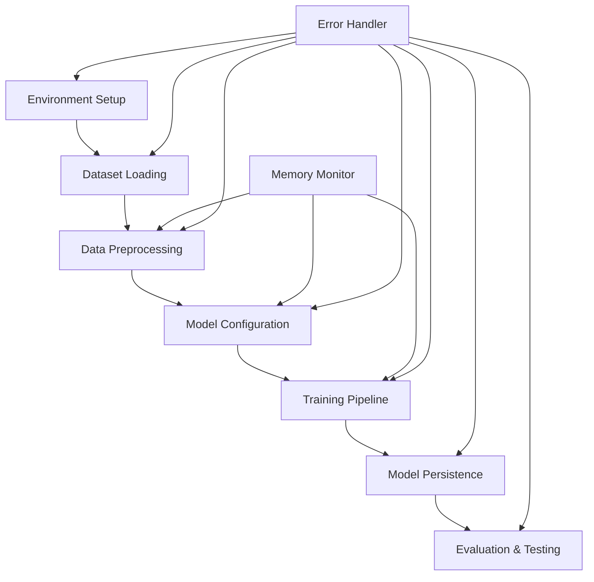

# Design Document

## Overview

This design outlines a comprehensive QLoRA-based fine-tuning system for medical language models using Unsloth's optimized framework in Google Colab. The system implements Parameter-Efficient Fine-Tuning (PEFT) techniques to adapt large language models to medical domains while maintaining memory efficiency through 4-bit quantization and Low-Rank Adaptation (LoRA).

The architecture follows a modular approach with distinct phases: environment setup, data preprocessing, model configuration, training execution, model persistence, and evaluation. Each component is designed to work within Colab's resource constraints while providing comprehensive monitoring and error handling capabilities.

## Architecture

### System Components



### Core Architecture Principles

1. **Memory Efficiency**: All components implement memory optimization strategies including 4-bit quantization, gradient checkpointing, and dynamic batch sizing
2. **Modularity**: Each phase is self-contained with clear interfaces and error boundaries
3. **Monitoring**: Comprehensive resource monitoring throughout the workflow
4. **Fault Tolerance**: Robust error handling with recovery mechanisms
5. **Extensibility**: Support for multiple base models and dataset formats

## Components and Interfaces

### 1. Environment Manager

**Purpose**: Handles Colab environment setup, dependency installation, and system verification

**Key Functions**:
- `setup_environment()`: Installs Unsloth and dependencies
- `verify_gpu_availability()`: Checks GPU resources and capabilities
- `display_system_info()`: Shows hardware specifications and library versions

**Interface**:
```python
class EnvironmentManager:
    def setup_environment(self) -> Dict[str, Any]
    def verify_gpu_availability(self) -> GPUInfo
    def display_system_info(self) -> SystemInfo
    def check_memory_requirements(self, model_name: str) -> bool
```

### 2. Dataset Handler

**Purpose**: Manages medical dataset loading, validation, and preprocessing

**Key Functions**:
- `load_medical_dataset()`: Loads datasets from various sources (HuggingFace, local files)
- `validate_dataset_format()`: Ensures proper Q&A or instruction format
- `preprocess_data()`: Formats data for instruction fine-tuning
- `create_data_splits()`: Handles train/validation splitting

**Interface**:
```python
class DatasetHandler:
    def load_medical_dataset(self, source: str, config: Dict) -> Dataset
    def validate_dataset_format(self, dataset: Dataset) -> ValidationResult
    def preprocess_data(self, dataset: Dataset, tokenizer: Tokenizer) -> ProcessedDataset
    def create_data_splits(self, dataset: Dataset, split_ratio: float) -> Tuple[Dataset, Dataset]
```

### 3. Model Configuration Manager

**Purpose**: Handles base model loading, QLoRA configuration, and adapter setup

**Key Functions**:
- `load_base_model()`: Loads pre-trained models with 4-bit quantization
- `configure_qlora()`: Sets up LoRA adapters with optimal parameters
- `validate_model_config()`: Ensures configuration fits memory constraints
- `display_model_info()`: Shows model architecture and trainable parameters

**Interface**:
```python
class ModelConfigManager:
    def load_base_model(self, model_name: str, config: ModelConfig) -> Tuple[Model, Tokenizer]
    def configure_qlora(self, model: Model, lora_config: LoRAConfig) -> Model
    def validate_model_config(self, config: ModelConfig) -> ValidationResult
    def display_model_info(self, model: Model) -> ModelInfo
```

### 4. Training Pipeline

**Purpose**: Orchestrates the fine-tuning process with monitoring and optimization

**Key Functions**:
- `setup_trainer()`: Configures Unsloth FastTrainer with optimal settings
- `execute_training()`: Runs epoch-based training with monitoring
- `monitor_resources()`: Tracks memory usage and performance metrics
- `handle_training_errors()`: Implements error recovery and optimization

**Interface**:
```python
class TrainingPipeline:
    def setup_trainer(self, model: Model, dataset: Dataset, config: TrainingConfig) -> Trainer
    def execute_training(self, trainer: Trainer) -> TrainingResults
    def monitor_resources(self) -> ResourceMetrics
    def handle_training_errors(self, error: Exception) -> RecoveryAction
```

### 5. Model Persistence Manager

**Purpose**: Handles saving, loading, and exporting of fine-tuned adapters

**Key Functions**:
- `save_adapter()`: Saves LoRA adapters with metadata
- `create_checkpoint()`: Creates training checkpoints
- `export_model()`: Prepares model for deployment or sharing
- `verify_saved_model()`: Validates saved model integrity

**Interface**:
```python
class ModelPersistenceManager:
    def save_adapter(self, model: Model, output_path: str) -> SaveResult
    def create_checkpoint(self, trainer: Trainer, checkpoint_path: str) -> CheckpointInfo
    def export_model(self, model_path: str, export_format: str) -> ExportResult
    def verify_saved_model(self, model_path: str) -> ValidationResult
```

### 6. Evaluation Engine

**Purpose**: Tests fine-tuned model performance on medical queries

**Key Functions**:
- `load_finetuned_model()`: Loads saved adapters for inference
- `generate_responses()`: Generates responses to medical queries
- `compare_performance()`: Compares pre/post fine-tuning performance
- `evaluate_medical_accuracy()`: Assesses domain-specific performance

**Interface**:
```python
class EvaluationEngine:
    def load_finetuned_model(self, adapter_path: str, base_model: str) -> Model
    def generate_responses(self, queries: List[str], model: Model) -> List[Response]
    def compare_performance(self, base_responses: List, finetuned_responses: List) -> ComparisonResult
    def evaluate_medical_accuracy(self, responses: List[Response], ground_truth: List) -> AccuracyMetrics
```

### 7. Memory Monitor

**Purpose**: Provides real-time memory monitoring and optimization

**Key Functions**:
- `monitor_gpu_memory()`: Tracks GPU memory usage
- `optimize_memory_usage()`: Implements memory optimization strategies
- `predict_memory_requirements()`: Estimates memory needs for operations
- `handle_memory_errors()`: Manages out-of-memory situations

**Interface**:
```python
class MemoryMonitor:
    def monitor_gpu_memory(self) -> MemoryStats
    def optimize_memory_usage(self, current_usage: float) -> OptimizationActions
    def predict_memory_requirements(self, operation: str, params: Dict) -> MemoryEstimate
    def handle_memory_errors(self, error: OutOfMemoryError) -> RecoveryStrategy
```

## Data Models

### Configuration Models

```python
@dataclass
class ModelConfig:
    model_name: str
    max_seq_length: int
    load_in_4bit: bool
    dtype: Optional[torch.dtype]
    trust_remote_code: bool

@dataclass
class LoRAConfig:
    r: int = 16  # LoRA rank
    lora_alpha: int = 32
    target_modules: List[str]
    lora_dropout: float = 0.1
    bias: str = "none"

@dataclass
class TrainingConfig:
    epochs: int
    batch_size: int
    gradient_accumulation_steps: int
    learning_rate: float
    warmup_steps: int
    save_steps: int
    logging_steps: int
    output_dir: str
    gradient_checkpointing: bool = True
```

### Runtime Models

```python
@dataclass
class GPUInfo:
    gpu_name: str
    total_memory: int
    available_memory: int
    compute_capability: str
    driver_version: str

@dataclass
class TrainingMetrics:
    epoch: int
    step: int
    loss: float
    learning_rate: float
    memory_usage: float
    throughput: float
    estimated_time_remaining: str

@dataclass
class ModelInfo:
    model_name: str
    total_params: int
    trainable_params: int
    memory_footprint: int
    quantization_config: Dict
```

### Dataset Models

```python
@dataclass
class MedicalDataPoint:
    instruction: str
    input: Optional[str]
    output: str
    metadata: Dict[str, Any]

@dataclass
class ProcessedDataset:
    train_data: List[MedicalDataPoint]
    eval_data: Optional[List[MedicalDataPoint]]
    tokenizer_config: Dict
    max_length: int
```

## Error Handling

### Error Categories and Recovery Strategies

1. **Memory Errors**
   - Out of GPU memory during model loading
   - Memory exhaustion during training
   - Recovery: Reduce batch size, enable gradient checkpointing, use CPU offloading

2. **Model Loading Errors**
   - Invalid model name or path
   - Incompatible model format
   - Recovery: Fallback to alternative models, validate model availability

3. **Dataset Errors**
   - Invalid dataset format
   - Missing required fields
   - Recovery: Data validation and automatic format conversion

4. **Training Errors**
   - Gradient explosion/vanishing
   - Convergence issues
   - Recovery: Learning rate adjustment, gradient clipping

5. **Environment Errors**
   - Missing dependencies
   - GPU unavailability
   - Recovery: Automatic installation, CPU fallback mode

### Error Handling Implementation

```python
class ErrorHandler:
    def handle_memory_error(self, error: OutOfMemoryError) -> RecoveryAction:
        # Implement memory optimization strategies
        pass
    
    def handle_model_error(self, error: ModelLoadError) -> RecoveryAction:
        # Implement model fallback strategies
        pass
    
    def handle_training_error(self, error: TrainingError) -> RecoveryAction:
        # Implement training recovery strategies
        pass
```

## Testing Strategy

### Unit Testing

1. **Component Testing**
   - Test each manager class independently
   - Mock external dependencies (GPU, datasets, models)
   - Validate error handling paths

2. **Configuration Testing**
   - Test various model configurations
   - Validate memory requirement calculations
   - Test parameter validation logic

### Integration Testing

1. **End-to-End Workflow Testing**
   - Test complete pipeline with small datasets
   - Validate data flow between components
   - Test checkpoint and resume functionality

2. **Memory Constraint Testing**
   - Test behavior under memory pressure
   - Validate optimization strategies
   - Test graceful degradation

### Performance Testing

1. **Memory Usage Testing**
   - Monitor memory consumption throughout workflow
   - Validate memory optimization effectiveness
   - Test memory leak detection

2. **Training Performance Testing**
   - Measure training throughput
   - Validate convergence behavior
   - Test scaling with different dataset sizes

### Medical Domain Testing

1. **Dataset Validation Testing**
   - Test with various medical dataset formats
   - Validate medical terminology handling
   - Test domain-specific preprocessing

2. **Model Quality Testing**
   - Evaluate medical response accuracy
   - Test domain adaptation effectiveness
   - Validate clinical knowledge retention

### Colab-Specific Testing

1. **Environment Testing**
   - Test dependency installation reliability
   - Validate GPU detection and allocation
   - Test session persistence handling

2. **Resource Constraint Testing**
   - Test behavior with Colab's memory limits
   - Validate timeout handling
   - Test checkpoint recovery after disconnection

## Implementation Notes

### Unsloth Integration

- Leverage Unsloth's FastLanguageModel for optimized model loading
- Use FastTrainer for memory-efficient training
- Implement Unsloth's data module for optimal tokenization

### Memory Optimization Strategies

- Implement gradient checkpointing by default
- Use dynamic batch sizing based on available memory
- Implement model sharding for large models
- Use CPU offloading for optimizer states

### Colab-Specific Optimizations

- Implement session state persistence
- Use Colab's file system for temporary storage
- Optimize for Colab's GPU types (T4, V100, A100)
- Handle Colab's runtime limitations gracefully

### Medical Domain Considerations

- Support medical terminology and abbreviations
- Implement domain-specific evaluation metrics
- Handle clinical data privacy requirements
- Support various medical dataset formats (MIMIC, PubMed, clinical notes)