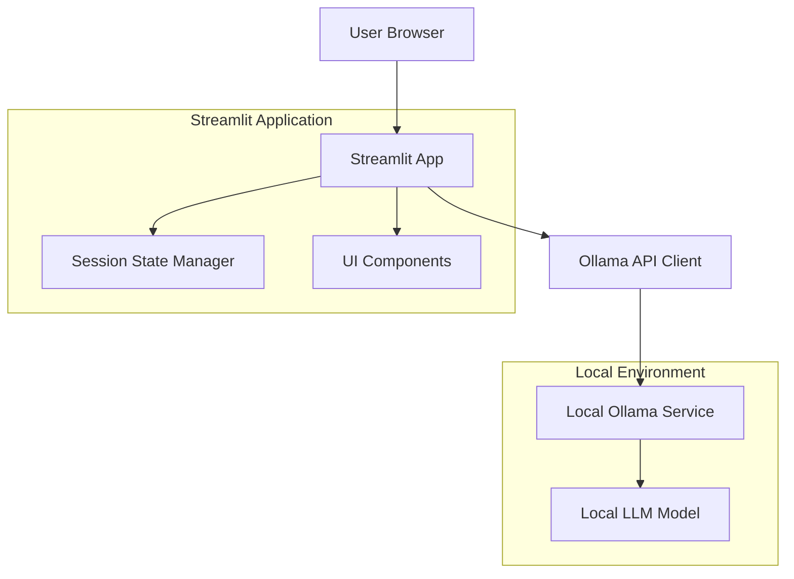

# Design Document

## Overview

The Streamlit LLM Interface is a web-based chat application that provides an intuitive interface for interacting with locally installed LLMs via Ollama. The application follows a simple client-server architecture where Streamlit serves as the frontend framework and communicates with the Ollama API running locally on the user's machine.

The design emphasizes simplicity, responsiveness, and robust error handling to ensure a smooth user experience even when dealing with local service dependencies.

## Architecture

### High-Level Architecture



### Component Interaction Flow

1. User interacts with Streamlit UI components
2. Streamlit app processes user input and validates it
3. App sends request to Ollama API via HTTP client
4. Ollama processes request with local LLM model
5. Response is received and processed by Streamlit app
6. UI is updated with response and conversation history

## Components and Interfaces

### 1. Main Application Module (`app.py`)
- **Purpose**: Entry point and main application orchestration
- **Responsibilities**:
  - Initialize Streamlit configuration
  - Coordinate between UI components and API client
  - Manage application state and session handling
  - Handle top-level error catching and user feedback

### 2. Ollama API Client (`ollama_client.py`)
- **Purpose**: Handle all communication with local Ollama service
- **Key Methods**:
  - `send_query(prompt: str, model: str) -> str`: Send query to LLM
  - `check_connection() -> bool`: Verify Ollama service availability
  - `list_models() -> List[str]`: Get available models
  - `is_model_available(model: str) -> bool`: Check specific model availability
- **Error Handling**: Connection timeouts, service unavailable, model not found

### 3. UI Components Module (`ui_components.py`)
- **Purpose**: Reusable Streamlit UI components
- **Components**:
  - `render_chat_input()`: Text input with validation
  - `render_conversation_history()`: Scrollable chat history
  - `render_reset_button()`: Conversation reset functionality
  - `render_status_indicator()`: Connection/loading status
  - `render_error_message()`: User-friendly error display

### 4. Session Manager (`session_manager.py`)
- **Purpose**: Manage conversation state and history
- **Key Functions**:
  - `initialize_session()`: Set up session state variables
  - `add_message(role: str, content: str)`: Add to conversation history
  - `clear_conversation()`: Reset conversation history
  - `get_conversation_history() -> List[Dict]`: Retrieve full history

### 5. Configuration Module (`config.py`)
- **Purpose**: Application configuration and constants
- **Settings**:
  - Ollama API endpoint (default: http://localhost:11434)
  - Default model name
  - Timeout settings
  - UI styling constants

## Data Models

### Message Structure
```python
@dataclass
class Message:
    role: str  # "user" or "assistant"
    content: str
    timestamp: datetime
    id: str  # unique identifier
```

### Conversation State
```python
@dataclass
class ConversationState:
    messages: List[Message]
    current_model: str
    is_loading: bool
    last_error: Optional[str]
```

### API Response Structure
```python
@dataclass
class OllamaResponse:
    content: str
    model: str
    done: bool
    error: Optional[str]
```

## Error Handling

### Connection Errors
- **Scenario**: Ollama service not running
- **Handling**: Display clear message with instructions to start Ollama
- **User Action**: Provide retry mechanism

### Model Availability Errors
- **Scenario**: Requested model not installed
- **Handling**: Show available models and installation instructions
- **Fallback**: Attempt to use default model if available

### Timeout Errors
- **Scenario**: LLM response takes too long
- **Handling**: Show timeout message with option to retry
- **Configuration**: Configurable timeout duration

### Input Validation Errors
- **Scenario**: Empty or invalid input
- **Handling**: Inline validation messages
- **Prevention**: Client-side input constraints

## Testing Strategy

### Unit Tests
- **Ollama Client**: Mock API responses, test error conditions
- **Session Manager**: Test state management and history operations
- **UI Components**: Test component rendering and interaction logic

### Integration Tests
- **API Integration**: Test with mock Ollama service
- **End-to-End Flow**: Test complete user interaction scenarios
- **Error Scenarios**: Test various failure modes

### Manual Testing
- **Cross-browser Compatibility**: Test on major browsers
- **Responsive Design**: Test on different screen sizes
- **Performance**: Test with long conversations and large responses

## User Experience Design

### Layout Structure
```
┌─────────────────────────────────────┐
│ Header: App Title & Status          │
├─────────────────────────────────────┤
│ Conversation History Panel          │
│ ┌─────────────────────────────────┐ │
│ │ User: Query 1                   │ │
│ │ Assistant: Response 1           │ │
│ │ User: Query 2                   │ │
│ │ Assistant: Response 2           │ │
│ └─────────────────────────────────┘ │
├─────────────────────────────────────┤
│ Input Section                       │
│ ┌─────────────────┐ ┌─────┐ ┌─────┐ │
│ │ Text Input      │ │Send │ │Reset│ │
│ └─────────────────┘ └─────┘ └─────┘ │
└─────────────────────────────────────┘
```

### Styling Approach
- Clean, minimal design with focus on readability
- Clear visual distinction between user and assistant messages
- Responsive layout that works on mobile and desktop
- Loading indicators for better user feedback
- Color coding for different message types and status indicators

## Performance Considerations

### Conversation History Management
- Implement pagination for very long conversations
- Consider memory usage with large conversation histories
- Optimize rendering of conversation history

### API Communication
- Implement request caching where appropriate
- Use streaming responses for long LLM outputs
- Handle concurrent requests gracefully

### Streamlit Optimization
- Minimize unnecessary re-renders using session state
- Use Streamlit's caching mechanisms for static data
- Optimize component updates for better responsiveness